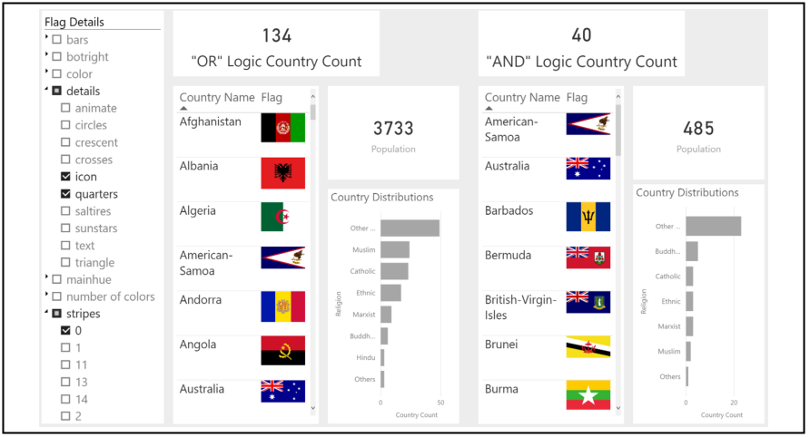

# [Changing "OR" to "AND" Logic for Power BI Slicers](https://medium.com/@ostus/changing-or-to-and-logic-for-power-bi-slicers-1a6b20aee5f5)
Author: [Orysya Stus](https://www.linkedin.com/in/orysyastus/)
Date: May 16, 2018

### Goal

Create the necessary calculated fields to change “OR” to “AND” logic for Power BI slicers (native slicer and the hierarchySlicer).

### Topics Covered
* So how do Power BI's slicers work?
* Why would you want to change the logic?
* But first let's discuss the data
* Case 1: Changing to "AND" Logic for Power BI's Native Slicer
* Case 2: Changing to "AND" Logic for Power BI's hierarchySlicer
* Recommendations
* Concluding Remarks
