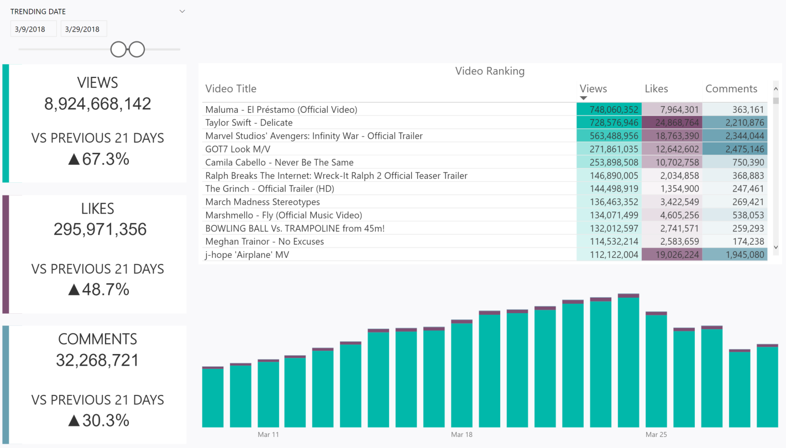

# [Dynamic Visuals Using Date Range Slicers in Power BI Part 2](https://medium.com/p/458423c8b213/edit)
Author: [Orysya Stus](https://www.linkedin.com/in/orysyastus/)

Date: December 17, 2018

### Goal

Create visuals which dynamically change depending on the date range picked in the slicer.

### Topics Covered
* Where do we start? The data, of course
* Let’s Built This!
    * Create a slicer called 'Trending Date" to pick through dates and see relative metric values.
    * Create DAX equations to dynamically change metrics and text based on dates ranges sliced
* Concluding Remarks
